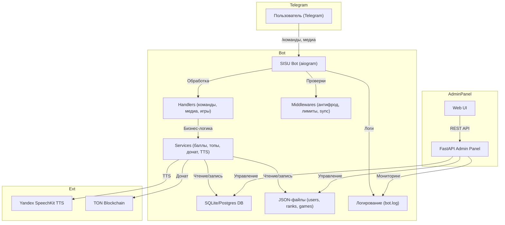

# Архитектура SISU Bot

## Описание компонентов

- **SISU Bot (aiogram)** — основной Telegram-бот, обрабатывает команды, медиа, игры, начисляет баллы, следит за лимитами и антифродом.
- **Handlers** — обработчики команд, медиа, игровых сценариев.
- **Middlewares** — антифрод, лимиты, синхронизация пользователей, разрешённые чаты.
- **Services** — бизнес-логика: баллы, топы, донат, TTS, рефералы, игры.
- **DB** — основная база (SQLite или Postgres), хранит пользователей, баллы, транзакции, логи.
- **DataFiles** — json-файлы с дополнительными данными (users, ranks, games, фразы).
- **Logger** — логирование действий и ошибок (bot.log).
- **Admin Panel** — FastAPI-приложение для управления ботом, пользователями, логами, мониторингом.
- **Yandex SpeechKit** — внешний сервис для генерации TTS.
- **TON Blockchain** — интеграция для доната и NFT.

---

**Диаграмма отражает все ключевые связи между компонентами, внешними сервисами и пользователями.** 